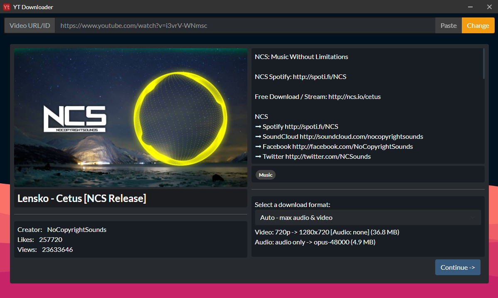
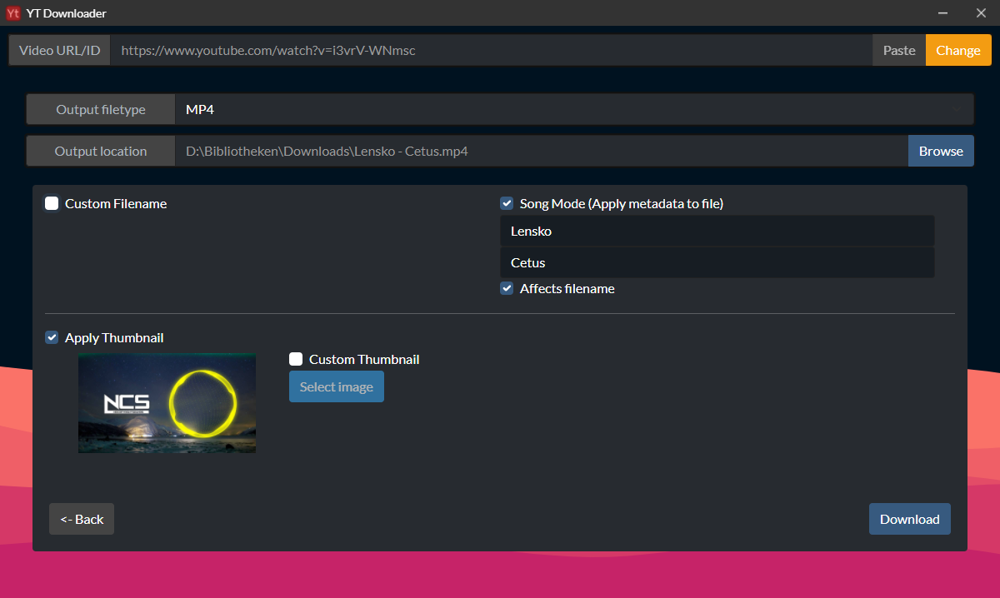

# YouTube Video Downloader

> Developed by [Davis_Software](https://github.com/Davis-Software) &copy; 2022

> The Recode: Now with a new awesome looking UI design!
> 
> Video info preview and easy/automatic format selection
> 
> 
> Optimized for audio downloads with ability to add custom metadata and a thumbnail
> 
> 
> #### And best of all... many UI animations and ripple effects!

# Features
- High Quality Download
- Applying metadata and thumbnails to output file
- Output converter
- Preview video information (thumbnail, title, description, views, etc...)
- Compatible with all [youtube-dl](https://github.com/ytdl-org/youtube-dl) websites (not only YouTube)
- Automatic download / update of [youtube-dl](https://github.com/ytdl-org/youtube-dl) and [FFMpeg](https://ffmpeg.org/)

# Requirements
* #### Releases
  * `tar` is required for extracting the `ffmpeg` archive on Linux
  * all other requirements are included in the installer or downloaded automatically
* #### Compiling
  * `git` is required for cloning the repository
  * `nodejs` and `npm` are required for compiling the application

# Installation
* Download an installer
  * Go to the [releases](https://github.com/Davis-Software/YTDownloader/releases) page and download an installer compatible with your OS
* Compile yourself:
  * Clone the repository `git clone https://github.com/Davis-Software/YTDownloader.git`
  * Enter directory `cd YTDownloader-master`
  * Install required packages `npm install`
  * Run the application to check if it's working `npm start`
  * Compile the application into an installer `npm run dist` (for win64)
  * Consult `package.json` for more commands & info
